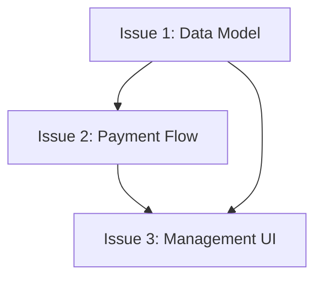

# Story: Detailed Reference

## Issue Template

```markdown
## Parent

Reference to parent issue (omit if source is existing issue, otherwise omit this section)

## What to build

Concise description of this vertical slice. Describe end-to-end behavior, not layer-by-layer implementation.

Avoid specific file paths or code snippets — they become stale quickly. Exception: if prototype-generated snippets encode decisions more precisely than prose (state machines, reducers, schemas, type shapes), inline here and briefly note it came from prototype. Trim to decision-rich parts — not working demo, just important bits.

## Acceptance Criteria

* [ ] Criterion 1
* [ ] Criterion 2
* [ ] Criterion 3

## Blocked by

* Reference to blocking tickets (if any)

Or "None - can start immediately" (if no blockers)
```

**Do not close or modify any parent issue.**

## Process Detail

### Step 1: Read PRD

Read `docs/prd/<feature-name>.md` file, understand complete requirements.

### Step 2: Explore Codebase (Optional)

If codebase not yet explored, do so to understand current state. Issue titles and descriptions should use project's domain glossary vocabulary and respect ADRs in areas you're touching.

### Step 3: Draft Vertical Slices

Break plan into **tracer bullet** issues. Each issue is a **thin vertical slice** that goes through all integration layers end-to-end, **not** a horizontal slice of one layer.

Slices may be 'HITL' or 'AFK':
- **HITL** slices require human interaction (architecture decisions, design reviews)
- **AFK** slices can be implemented and merged without human interaction

**Vertical slice rules:**
- Each slice traces one narrow but **complete** path through every layer (schema, API, UI, tests)
- Completed slice is demonstrable or verifiable on its own
- Prefer many thin slices over few thick slices

### Step 4: Present to User

Present proposed breakdown as numbered list. For each slice, show:

- **Title**: Short descriptive name
- **Type**: HITL / AFK
- **Blocked by**: Other slices that must complete first (if any)
- **User stories covered**: Which user stories this solves (if source material has them)

Ask user:
- Does granularity feel right? (too coarse / too fine)
- Are dependencies correct?
- Should any slices be merged or split further?
- Are slices correctly marked HITL and AFK?

Iterate until user approves breakdown.

### Step 5: Publish Issues

For each approved slice, publish new issue to tracker. Use issue body template above. If not otherwise indicated, these issues are considered ready for AFK agents, so publish with correct triage labels.

Publish issues in dependency order (blockers first) so you can reference real issue identifiers in "Blocked by" fields.

### Step 6: Update PRD

Add created issues to PRD's `Child Issues` section:

```markdown
## Child Issues
* #<issue-1> — <title>
* #<issue-2> — <title>
* #<issue-3> — <title>
```

### Step 7: Sync GitHub Issue (if exists)

If parent GitHub Issue exists, update its body to include child issues list.

## Horizontal vs Vertical Slices

**WRONG (Horizontal):**
```
Issue 1: All database schemas
Issue 2: All API endpoints
Issue 3: All UI components
```
- No issue is independently verifiable
- Cannot demo until all complete
- High coordination risk

**RIGHT (Vertical):**
```
Issue 1: Subscription schema + CRUD API + tests
Issue 2: Payment flow + webhook handling + tests
Issue 3: Management UI + E2E tests
```
- Each issue is verifiable independently
- Can demo after each issue
- Lower coordination risk

## Slice Thickness

**Too thick:**
- "Build entire subscription system" (contains multiple features)

**Just right:**
- "Create subscription data model"
- "Implement payment processing"
- "Build management UI"

**Too thin:**
- "Create subscription table"
- "Add subscription API endpoint"
- "Write subscription test" (micro-fragments, overhead dominates)

## Dependencies



In this example:
- Issue 2 is blocked by Issue 1 (needs data model)
- Issue 3 is blocked by both Issue 1 and Issue 2 (needs model + payment flow)

Publish in order: A → B → C, so A's issue number is available when referencing from B and C.
