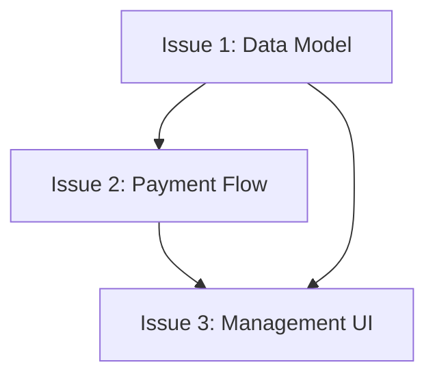

# Story: Detailed Reference

## Issue Template

```markdown
## Parent

Reference to parent issue (omit if source is existing issue, otherwise omit this section)

## What to build

Concise description of this vertical slice. Describe end-to-end behavior, not layer-by-layer implementation.

Avoid specific file paths or code snippets — they become stale quickly. Exception: if prototype-generated snippets encode decisions more precisely than prose (state machines, reducers, schemas, type shapes), inline here and briefly note it came from prototype. Trim to decision-rich parts — not working demo, just important bits.

## Acceptance Criteria

* [ ] Criterion 1
* [ ] Criterion 2
* [ ] Criterion 3

## Blocked by

* Reference to blocking tickets (if any)

Or "None - can start immediately" (if no blockers)
```

**Do not close or modify any parent issue.**

## Process Detail

### Step 0: Determine Input Source

Check what input the user provided:

1. **Existing PRD** — user mentions a feature name with an existing PRD file at `docs/prd/<feature-name>.md`, or says "break this PRD into issues"
2. **Direct description** — user describes a feature verbally: "帮我拆分用户订阅功能的 issues", "break down the payment integration", or provides a rough spec
3. **Existing issue** — user references an existing issue number as the parent

**PRD Issue field detection:** When an existing PRD is found, read its `## Issue` section (e.g., `#42`). If present, this is the parent issue — use it as the parent reference when creating child issues in Step 6, and update it in Step 8. Do not ask the user for the parent if it's already recorded in the PRD.

If a PRD exists, skip to Step 3 (Draft Vertical Slices).

If no PRD exists and the user gave a direct description, proceed to Step 1 to extract requirements.

### Step 1: Extract Requirements

**When input is a direct description (no PRD):**

1. Parse the user's description for:
   - What to build (goal)
   - Key requirements (explicitly stated or implied)
   - Any mentioned constraints or preferences
2. Explore the codebase to fill gaps:
   - What exists already (models, APIs, services related to the feature)
   - Project conventions (patterns, naming, testing style)
   - Check `CONTEXT.md` for domain glossary, `docs/adr/` for relevant decisions
3. Ask focused clarification questions — only for genuinely ambiguous points. Do NOT run a full brainstorming session (that's `/think`'s job). Maximum 2-3 questions.
4. Compile findings into a requirements list.

**When input is an existing PRD:**

Read `docs/prd/<feature-name>.md` file, understand complete requirements. After reading, check the `Issue` field for a parent issue number (e.g., `#42`). If present, use it as the parent reference when creating child issues. If absent, no parent reference needed.

**Minimal requirements to proceed:**
- Goal (what this feature does)
- At least 2 requirements
- At least 1 acceptance criterion

If these cannot be extracted, suggest running `/think` first — the feature is too underspecified for direct slicing.

### Step 2: Ensure PRD Exists

If PRD already exists at `docs/prd/<feature-name>.md`: skip this step.

If no PRD exists, create a minimal PRD using the template from `think/PRD-FORMAT.md`. Only fill sections where you have information:

- `Goal` — from the user's description
- `What I already know` — facts from description + codebase exploration
- `Requirements` — extracted in Step 1
- `Acceptance Criteria` — derived from requirements
- `Out of Scope` — if the user mentioned boundaries
- `Technical Notes` — findings from codebase exploration

Omit sections you have no information for entirely — do not leave empty headings in the file. Only include sections with real content. Sections like Research References, Feasible Approaches, Decision (ADR-lite), and Implementation Plan are `/think`'s output, not required for slicing.

Write the file. This PRD will be updated in Step 7 with child issues.

### Step 3: Explore Codebase (Optional)

If codebase not yet explored, do so to understand current state. Issue titles and descriptions should use project's domain glossary vocabulary and respect ADRs in areas you're touching.

### Step 4: Draft Vertical Slices

Break plan into **tracer bullet** issues. Each issue is a **thin vertical slice** that goes through all integration layers end-to-end, **not** a horizontal slice of one layer.

Slices may be 'HITL' or 'AFK':
- **HITL** slices require human interaction at some point (architecture decisions, design reviews, UX choices). Marked for the human's project planning.
- **AFK** slices can be implemented end-to-end without human interaction. Suitable for autonomous agent execution.

**Vertical slice rules:**
- Each slice traces one narrow but **complete** path through every layer (schema, API, UI, tests)
- Completed slice is demonstrable or verifiable on its own
- Prefer many thin slices over few thick slices

### Step 5: Present to User

Present proposed breakdown as numbered list. For each slice, show:

- **Title**: Short descriptive name
- **Type**: HITL / AFK
- **Blocked by**: Other slices that must complete first (if any)
- **User stories covered**: Which user stories this solves (if source material has them)

Ask user:
- Does granularity feel right? (too coarse / too fine)
- Are dependencies correct?
- Should any slices be merged or split further?
- Are slices correctly marked HITL and AFK?

Iterate until user approves breakdown.

### Step 6: Publish Issues

Read `docs/agents/issue-tracker.md` for the issue creation convention (e.g., `gh issue create`, `glab issue create`, or writing markdown files). Read `docs/agents/triage-labels.md` for the label mapping.

For each approved slice, publish new issue to tracker. Use issue body template above. If not otherwise indicated, these issues are considered ready for AFK agents, so publish with correct triage labels.

Publish issues in dependency order (blockers first) so you can reference real issue identifiers in "Blocked by" fields.

### Step 7: Update PRD

Add created issues to PRD's `Child Issues` section:

```markdown
## Child Issues
* #<issue-1> — <title> (AFK)
* #<issue-2> — <title> (HITL, blocked by #<issue-1>)
* #<issue-3> — <title> (AFK)
```

### Step 8: Sync Issue (if exists)

If parent Issue exists, update its body to include child issues list.

## Horizontal vs Vertical Slices

**WRONG (Horizontal):**
```
Issue 1: All database schemas
Issue 2: All API endpoints
Issue 3: All UI components
```
- No issue is independently verifiable
- Cannot demo until all complete
- High coordination risk

**RIGHT (Vertical):**
```
Issue 1: Subscription schema + CRUD API + tests
Issue 2: Payment flow + webhook handling + tests
Issue 3: Management UI + E2E tests
```
- Each issue is verifiable independently
- Can demo after each issue
- Lower coordination risk

## Slice Thickness

**Too thick:**
- "Build entire subscription system" (contains multiple features)

**Just right:**
- "Create subscription data model"
- "Implement payment processing"
- "Build management UI"

**Too thin:**
- "Create subscription table"
- "Add subscription API endpoint"
- "Write subscription test" (micro-fragments, overhead dominates)

## Dependencies



In this example:
- Issue 2 is blocked by Issue 1 (needs data model)
- Issue 3 is blocked by both Issue 1 and Issue 2 (needs model + payment flow)

Publish in order: A → B → C, so A's issue number is available when referencing from B and C.
